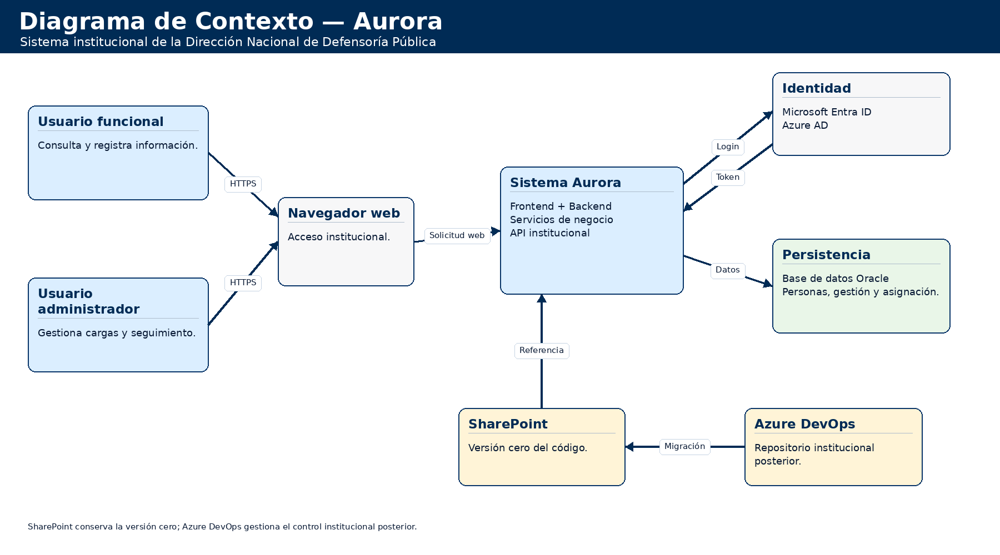
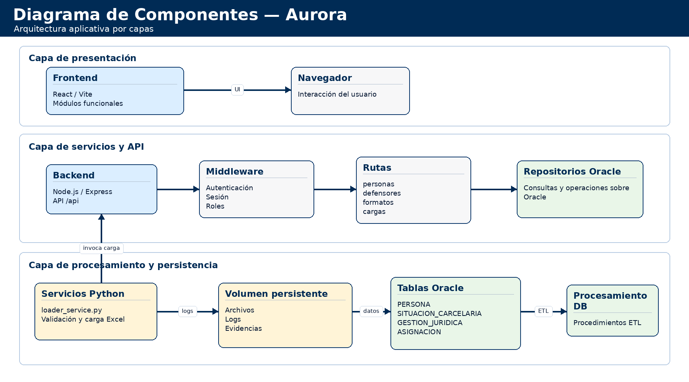
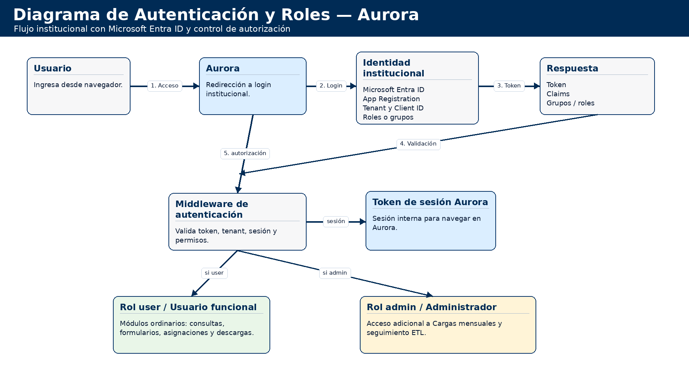
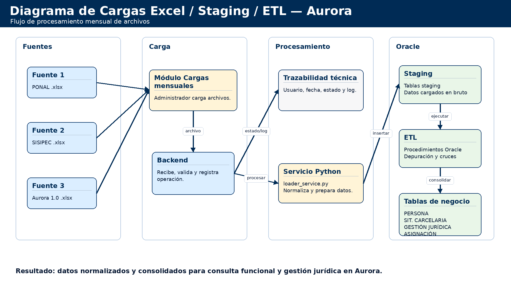

# Arquitectura del sistema Aurora

> Estado documental: vigente al 2026-07-30.

## Control de cambios

| Versión | Fecha | Responsable | Descripción del cambio | Aprobación |
| --- | --- | --- | --- | --- |
| 1.0 | 2026-05-19 | Dirección Nacional de Defensoría Pública (DNDP) - Grupo de Transformación Digital | Versión inicial de entrega técnica. | Equipo DNDP |
| 1.1 | 2026-05-28 | Dirección Nacional de Defensoría Pública (DNDP) - Grupo de Transformación Digital | Ajuste de formato institucional, control documental, índice, repositorio institucional, despliegue, roles, URL de ambiente y pruebas. | Pendiente aprobación institucional |
| 1.2 | 2026-07-30 | Dirección Nacional de Defensoría Pública (DNDP) - Grupo de Transformación Digital | Incorporación de LDAP, usuarios autorizados, PWA segura, manual interactivo, controles de codificación y componentes operativos vigentes. | Pendiente aprobación institucional |

## Tabla de contenido

Índice generado con la estructura de títulos del documento.

Objeto

Vista de contexto

Componentes

Diagramas requeridos

Flujo de autenticación y roles

Flujo de cargas mensuales

Diagramas de apoyo

Diagrama de contexto de Aurora

Diagrama de componentes de Aurora

Diagrama de despliegue de Aurora

Diagrama de autenticación y roles de Aurora

Diagrama de cargas Excel, staging y ETL de Aurora

## Objeto

Este documento presenta la arquitectura funcional y técnica de Aurora, incluyendo componentes, despliegue, autenticación, datos y cargas mensuales.

## Vista de contexto

Aurora es una aplicación web para apoyar la atención jurídica de personas privadas de la libertad. Los usuarios autorizados acceden mediante navegador, se autentican contra Microsoft Entra ID y consumen servicios del backend, el cual consulta y actualiza información en Oracle.

## Componentes

| Componente | Descripción |
| --- | --- |
| Frontend React/Vite | Interfaz web y navegación de módulos funcionales. |
| Backend Express | API, autenticación, autorización y servicio del frontend compilado. |
| Oracle | Fuente principal de personas, situaciones, gestiones, asignaciones y catálogos. |
| Microsoft Entra ID | Autenticación institucional y emisión de roles/grupos. |
| Cargas mensuales | Recepción de Excel, carga a staging, ejecución ETL y bitácora. |
| SharePoint/Azure DevOps | Entrega versión cero y control institucional posterior del código. |
| Directorio interno de usuarios | Control de usuarios habilitados, roles, importación CSV y persistencia en volumen. |
| Servicio LDAP/LDAPS | Autenticación directa alternativa contra Active Directory cuando está habilitada. |
| PWA y manual interactivo | Caché del shell, cola offline ligada a identidad y tutoriales locales verificados por hash. |

## Diagramas requeridos

La versión final debe incluir imágenes de arquitectura en formato PNG o equivalente, generadas con la herramienta de diagramación institucional que defina la entidad.

- Diagrama de contexto.

- Diagrama de componentes.

- Diagrama de despliegue/red.

- Diagrama de autenticación y roles.

- Diagrama de cargas Excel/staging/ETL.

Instrucción sugerida para herramienta de diagramación: Diseñar un diagrama de arquitectura institucional para Aurora. Incluir usuario autorizado, navegador, frontend React/Vite servido por backend Express, API /api, Microsoft Entra ID para autenticación y roles admin/user, Oracle como base de datos, módulo de cargas Excel para PONAL/SISIPEC/Aurora 1.0, tablas staging, procedimientos ETL, SharePoint como versión cero de código y Azure DevOps como repositorio institucional. Mostrar despliegue Docker Compose en servidor de aplicaciones puerto 7860, conexión Oracle puerto 1521, opción de proxy/HTTPS institucional y separación entre usuario funcional y administrador.

## Flujo de autenticación y roles

1. El usuario ingresa a Aurora desde el navegador.

2. El frontend solicita configuración de autenticación al backend.

3. Si Azure AD está configurado, el usuario inicia sesión con la cuenta institucional.

4. El backend valida tenant, client ID, dominio, grupos o roles requeridos.

5. Aurora emite un token propio con identidad y roles.

6. El frontend muestra módulos según roles; Cargas mensuales solo aparece para roles administrativos.

## Flujo de cargas mensuales

1. El administrador ingresa al módulo Cargas mensuales.

2. Selecciona fuente PONAL, SISIPEC o Aurora 1.0.

3. Carga archivo .xlsx.

4. El backend registra la carga, usuario y log operativo.

5. El servicio Python valida y carga staging.

6. Oracle ejecuta el procedimiento ETL correspondiente.

7. El usuario revisa estado, log y evidencia.

## Arquitectura física vigente

El mecanismo principal construye un único contenedor. La primera etapa del Dockerfile usa Node.js 20.19 para instalar y compilar el frontend. La etapa productiva instala Python y las dependencias de carga, instala únicamente dependencias productivas del backend, incorpora el frontend compilado y ejecuta Express. El mismo origen sirve la interfaz y `/api`, por lo que `VITE_API_BASE_URL=/api` evita dependencias de una URL interna.

Docker Compose publica `${HOST_PORT:-443}:${PORT:-7860}`. El proceso escucha en el puerto interno `7860`; la terminación TLS puede estar en Aurora mediante rutas de certificado o en un proxy/balanceador institucional. Los volúmenes `aurora_auth_users` y `aurora_cargas_bd` separan el estado operativo del ciclo de vida del contenedor.

El contenedor ejecuta como usuario sin privilegios. El entrypoint prepara los directorios persistentes con los permisos requeridos y luego reduce privilegios. El `HEALTHCHECK` consulta `/api/health` y selecciona HTTP o HTTPS según la configuración de certificados.

## Límite de confianza y flujos de seguridad

El navegador no es una fuente confiable de roles ni de identidad. En Entra ID, el frontend obtiene el token institucional y el backend valida firma, emisor, audiencia, tenant y restricciones configuradas antes de emitir un JWT propio. En LDAP, el backend valida el dominio permitido y realiza el bind directo sin almacenar la contraseña. En ambos caminos, el directorio interno puede exigir que la cuenta esté habilitada.

Cada petición protegida pasa por `requireAuth`. Los privilegios administrativos, PAG y cargas se verifican nuevamente en el backend. La visibilidad de menús en React mejora la experiencia, pero no constituye autorización.

La sesión interna contiene emisor y audiencia configurables, expiración, identidad y roles. El límite de intentos protege los endpoints de login. Helmet agrega cabeceras de seguridad y CORS queda restringido a mismo origen cuando `CORS_ORIGIN` está vacío.

## Flujo de consulta y persistencia

1. La interfaz solicita listados o detalle a `/api/ppl`.
2. El servicio funcional valida y normaliza parámetros.
3. Los repositorios ejecutan SQL parametrizado mediante el pool compartido de `node-oracledb`.
4. `ORACLE_SCHEMA` sustituye las referencias de esquema controladas, sin interpolar entrada del usuario.
5. Los resultados se normalizan antes de salir de la API y el frontend aplica las reglas de presentación.
6. Las escrituras de formulario, actuaciones, calificaciones y asignaciones usan repositorios específicos.

Los listados de condenados emplean paginación acotada y opciones de filtro con caché temporal. La búsqueda de defensores cuenta con comparación tolerante a tildes y a variantes previsibles de texto mal decodificado. Cuando la cédula del defensor existe, el nombre canónico del catálogo `DEFENSORES` tiene prioridad sobre texto histórico dañado.

## Operación sin conexión

La PWA almacena recursos del shell para permitir apertura controlada. Solo determinadas escrituras pueden entrar a una cola local cuando la red falla. Cada elemento se vincula a la identidad autenticada; al cerrar sesión o cambiar de usuario se descartan operaciones que no pertenecen a la sesión actual. El mecanismo no sustituye la base de datos ni autoriza trabajo indefinido sin conectividad.

## Disponibilidad y observabilidad

`/api/health` confirma que Express responde y `/api/health/db` ejecuta `SELECT 1 AS DB_OK FROM dual`. El primer control alimenta el healthcheck del contenedor; el segundo distingue disponibilidad de aplicación y disponibilidad de Oracle. Los logs se consultan con Docker Compose y no deben exponer contraseñas, tokens, SQL completo con valores sensibles ni trazas internas al usuario final.

La arquitectura no incorpora balanceo interno, réplica de Oracle ni almacenamiento distribuido. Si la entidad requiere alta disponibilidad, el proxy, el orquestador, la estrategia de sesiones y los volúmenes deben diseñarse como una ampliación explícita.

## Diagramas de apoyo

### Diagrama de contexto de Aurora

Figura. Diagrama de contexto de Aurora.

### Diagrama de componentes de Aurora

Figura. Diagrama de componentes de Aurora.

### Diagrama de despliegue de Aurora

Figura. Diagrama de despliegue de Aurora.

### Diagrama de autenticación y roles de Aurora

Figura. Diagrama de autenticación y roles de Aurora.

### Diagrama de cargas Excel, staging y ETL de Aurora

Figura. Diagrama de cargas Excel, staging y ETL de Aurora.
