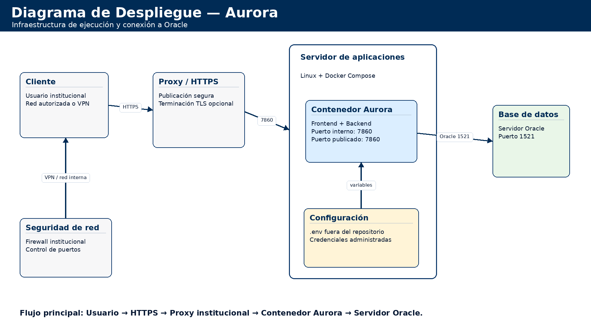

# Infraestructura de Aurora

> Estado documental: vigente al 2026-07-30.


## Control de cambios

| Versión | Fecha | Responsable | Descripción del cambio | Aprobación |
| --- | --- | --- | --- | --- |
| 1.0 | 2026-05-19 | Dirección Nacional de Defensoría Pública (DNDP) - Grupo de Transformación Digital | Versión inicial de entrega técnica. | Equipo DNDP |
| 1.1 | 2026-05-28 | Dirección Nacional de Defensoría Pública (DNDP) - Grupo de Transformación Digital | Ajuste de formato institucional, control documental, índice, repositorio institucional, despliegue, roles, URL de ambiente y pruebas. | Pendiente aprobación institucional |
| 1.2 | 2026-07-30 | Dirección Nacional de Defensoría Pública (DNDP) - Grupo de Transformación Digital | Actualización de puertos, volúmenes, TLS, requisitos de red, capacidad, respaldo y observabilidad. | Pendiente aprobación institucional |

## Tabla de contenido

Índice generado con la estructura de títulos del documento.

Objeto

Ambiente temporal identificado

Arquitectura de despliegue

Responsabilidades

Diagramas de apoyo

Diagrama de despliegue de Aurora


## Objeto

Este documento describe la infraestructura requerida y el direccionamiento de Aurora para ambientes de pruebas, preproducción y producción.

## Ambiente temporal identificado

| Elemento | Detalle | Estado |
| --- | --- | --- |
| Servidor de aplicaciones | 172.31.64.7 | Identificado en ambiente técnico actual |
| Puerto interno de aplicación | 7860 | Configurado en Docker Compose y backend |
| Puerto publicado por defecto | 443 | Definido por `HOST_PORT`; sujeto a la arquitectura institucional |
| URL interna de servidor | http://127.0.0.1:7860 | Validada desde el servidor |
| URL temporal por IP privada | http://172.31.64.7:7860 | Sujeta a reglas de red/firewall/VPN |
| Acceso por túnel SSH | http://localhost:8787 | Validado desde equipo cliente |
| URL institucional HTTPS | Pendiente de asignación por Infraestructura | Pendiente |
| Servidor de base de datos | Por confirmar con DBA/entidad | Pendiente de ratificación institucional |

El servicio de aplicación no debe documentarse para usuarios finales como localhost. Localhost y 127.0.0.1 son referencias internas de servidor o de túnel SSH.

## Arquitectura de despliegue

- Contenedor Docker único para frontend y backend.

- Frontend compilado servido desde backend Express.

- API disponible bajo /api.

- Oracle como fuente principal de datos.

- Módulo de cargas mensuales con volumen Docker persistente.

## Responsabilidades

| Responsable | Actividad |
| --- | --- |
| Infraestructura | Asignar URL institucional, proxy, DNS, firewall y publicación. |
| DBA | Confirmar servidor Oracle, servicio, esquema y permisos. |
| Equipo técnico DNDP | Entregar código, guía, variables requeridas y soporte. |
| Seguridad | Validar controles de acceso, roles y custodia de secretos. |

## Requisitos del servidor

El servidor ejecuta Docker Engine y Docker Compose Plugin, dispone de conectividad a los registros autorizados durante la construcción y cuenta con espacio para capas de imagen, logs y cargas. La imagen fija Node.js 20.19 y agrega Python 3 con las dependencias declaradas en `scripts/cargas_bd/requirements.txt`.

La capacidad de CPU, memoria y disco depende de concurrencia, volumen de cargas y política de retención. Infraestructura mide el consumo durante aceptación, reserva espacio para Docker y volúmenes y configura alertas. Los archivos Excel de hasta `CARGUEBD_MAX_FILE_MB` y sus logs influyen directamente en el crecimiento.

## Red, puertos y dependencias

| Origen | Destino | Puerto/protocolo | Finalidad |
| --- | --- | --- | --- |
| Cliente autorizado | URL de Aurora | 443/TCP HTTPS | Interfaz y API en el mismo origen. |
| Proxy o balanceador | Contenedor Aurora | 7860/TCP HTTP o HTTPS | Publicación interna según terminación TLS. |
| Aurora | Oracle | 1521/TCP por defecto | Consultas y transacciones Node y Python. |
| Aurora y navegador | Microsoft Entra ID | 443/TCP HTTPS | Login, JWKS y validación institucional. |
| Aurora | Active Directory | 389/TCP LDAP o 636/TCP LDAPS | Alternativa de autenticación habilitable. |
| Servidor de construcción | registros autorizados | 443/TCP HTTPS | Imagen base y dependencias. |

La aplicación no expone Oracle, LDAP ni sus volúmenes al cliente.

## TLS y publicación

En el modelo preferente, un proxy institucional presenta el certificado público y reenvía HTTP hacia el puerto interno. En el modelo directo, Aurora recibe `HTTPS_KEY_PATH` y `HTTPS_CERT_PATH`, montados desde `backend/certs` en modo solo lectura. Se configuran ambos valores o ninguno.

El origen visible coincide exactamente con la Redirect URI SPA registrada en Entra ID. `CORS_ORIGIN` permanece vacío para mismo origen y solo se llena con orígenes explícitos cuando la arquitectura lo exige.

## Persistencia y respaldo

`aurora_auth_users` conserva el directorio interno de acceso. `aurora_cargas_bd` conserva archivos, registro e historial de cargas. Reemplazar el contenedor no elimina estos volúmenes; `docker compose down -v` sí los elimina y no forma parte de una actualización ordinaria.

La política de respaldo cubre ambos volúmenes y Oracle. Un respaldo solo se considera operativo después de probar su restauración. Los certificados y el `.env` se custodian fuera de la imagen y del repositorio.

## Observabilidad y operación

El healthcheck consulta `/api/health` cada 30 segundos, con periodo inicial de 30 segundos y tres reintentos. `/api/health/db` verifica Oracle por separado. La supervisión alerta por contenedor no saludable, reinicios repetidos, errores de conexión, falta de espacio y crecimiento anormal.

```bash
docker compose ps
docker compose logs --tail=200 aurora
docker stats aurora
docker system df
curl -k https://127.0.0.1:7860/api/health
curl -k https://127.0.0.1:7860/api/health/db
```

`-k` solo se admite en una validación interna controlada; los clientes productivos validan la cadena completa.

## Continuidad y recuperación

`restart: unless-stopped` permite que el servicio vuelva a iniciar cuando Docker arranca, salvo detención explícita. Infraestructura habilita Docker en el sistema operativo y prueba un reinicio controlado.

La recuperación requiere código o imagen identificada, `.env` custodiado, certificados cuando aplican, volúmenes restaurados y conectividad Oracle. Después de levantar se comprueban salud, autenticación y una transacción funcional de bajo riesgo.

## Diagramas de apoyo

### Diagrama de despliegue de Aurora



Figura. Diagrama de despliegue de Aurora.
