# Manual de usuario de Aurora

> Estado documental: vigente al 2026-07-30.

## Control de cambios

| Versión | Fecha | Responsable | Descripción del cambio | Aprobación |
| --- | --- | --- | --- | --- |
| 1.0 | 2026-05-19 | Dirección Nacional de Defensoría Pública (DNDP) - Grupo de Transformación Digital | Versión inicial de entrega técnica. | Equipo DNDP |
| 1.1 | 2026-05-28 | Dirección Nacional de Defensoría Pública (DNDP) - Grupo de Transformación Digital | Ajuste de formato institucional, control documental, índice, repositorio institucional, despliegue, roles, URL de ambiente y pruebas. | Pendiente aprobación institucional |
| 1.2 | 2026-07-30 | Dirección Nacional de Defensoría Pública (DNDP) - Grupo de Transformación Digital | Actualización de perfiles, aviso de datos, usuarios autorizados, manual interactivo, operación offline y búsquedas compatibles con datos heredados. | Pendiente aprobación institucional |

## Tabla de contenido

Índice generado con la estructura de títulos del documento.

Objetivo del manual

Ingreso al sistema

Pantalla inicial y navegación

Consultar una persona

Diligenciar el formulario de atención

Historial y acción a impulsar

Asignación y reasignación de defensores

Descarga de formatos

Cargas mensuales

Buenas prácticas de uso

Anexo de capturas de apoyo

## Objetivo del manual

Este manual explica el uso funcional de Aurora para usuarios autorizados de la entidad. Presenta los pasos principales para ingresar, consultar, diligenciar información, hacer seguimiento, asignar defensores, descargar formatos y operar cargas mensuales cuando el perfil lo permita.

## Ingreso al sistema

1. Abra la URL asignada para Aurora.

2. Ingrese su usuario institucional.

3. Ingrese su contraseña o continúe con el mecanismo institucional disponible.

4. Seleccione Iniciar sesión.

5. Si el sistema no permite el ingreso, solicite validación de cuenta, grupo o rol autorizado.

Cuando el acceso institucional usa Entra ID, el navegador abre la autenticación de Microsoft. Cuando el ambiente usa LDAP, la pantalla solicita las credenciales institucionales directamente. El login local solo corresponde a una contingencia técnica expresamente habilitada.

Después del primer ingreso o cuando cambia la versión del aviso, Aurora presenta el tratamiento de datos personales. Es necesario leerlo y aceptarlo para continuar. Rechazarlo cierra la sesión.

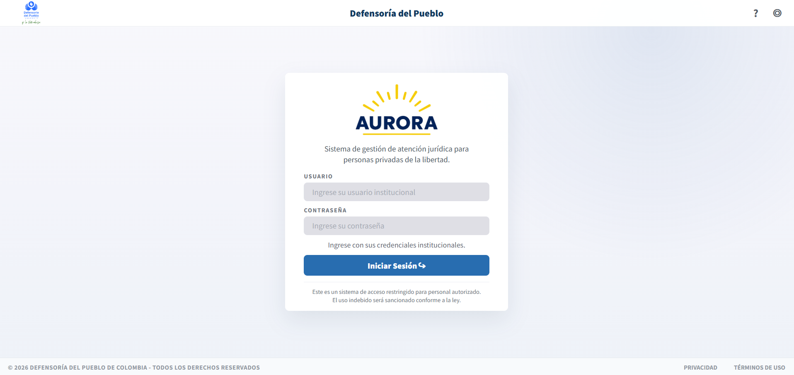

Figura 1. Captura de apoyo del módulo.

## Pantalla inicial y navegación

Después del ingreso, Aurora muestra los módulos según el perfil. `user` accede a operación ordinaria; `pag` habilita PAG - Asignación de casos; `admin` habilita Usuarios autorizados; los roles de cargas habilitan Cargas mensuales. Una cuenta puede combinar roles.

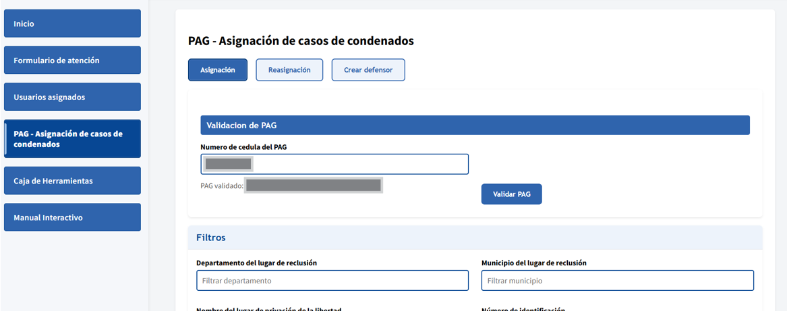

Figura 2. Captura de apoyo del módulo.

## Consultar una persona

1. Ingrese al formulario de atención o al listado de usuarios asignados.

2. Digite el número de documento de la persona.

3. Revise la información cargada en pantalla.

4. Si no encuentra el registro, verifique el número o consulte con el responsable funcional.

En Usuarios asignados, el campo Defensor admite el nombre visible aunque la fuente histórica contenga tildes dañadas. Escriba una parte significativa del nombre y seleccione Buscar. También puede usar la cédula de cada persona para comprobar un caso individual. Si la cédula del defensor está vinculada al catálogo, Aurora muestra su nombre canónico.

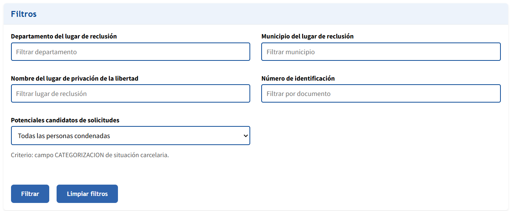

Figura 3. Captura de apoyo del módulo.

## Diligenciar el formulario de atención

1. Revise los datos básicos antes de registrar información.

2. Diligencie las preguntas habilitadas según el tipo de caso.

3. Avance por los bloques visibles del formulario.

4. Guarde la información cuando finalice la actuación o cuando requiera conservar el avance.

5. Verifique el mensaje de confirmación del sistema.

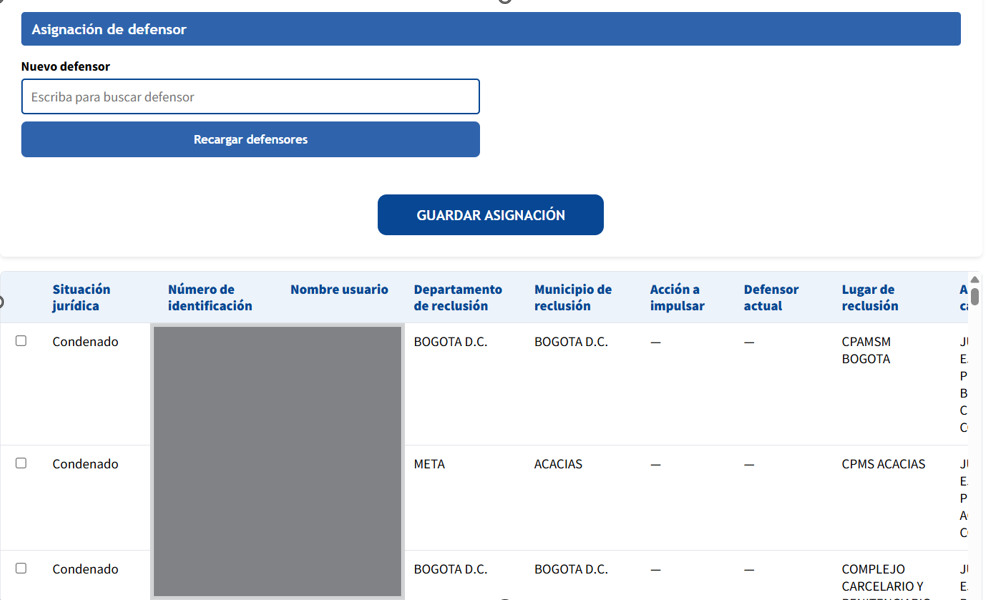

Figura 4. Captura de apoyo del módulo.

## Historial y acción a impulsar

El historial permite revisar actuaciones anteriores y continuar la actuación activa. La acción a impulsar cambia de acuerdo con el avance del formulario, por ejemplo analizar el caso, entrevistar al usuario, presentar solicitud, pendiente decisión o caso cerrado.

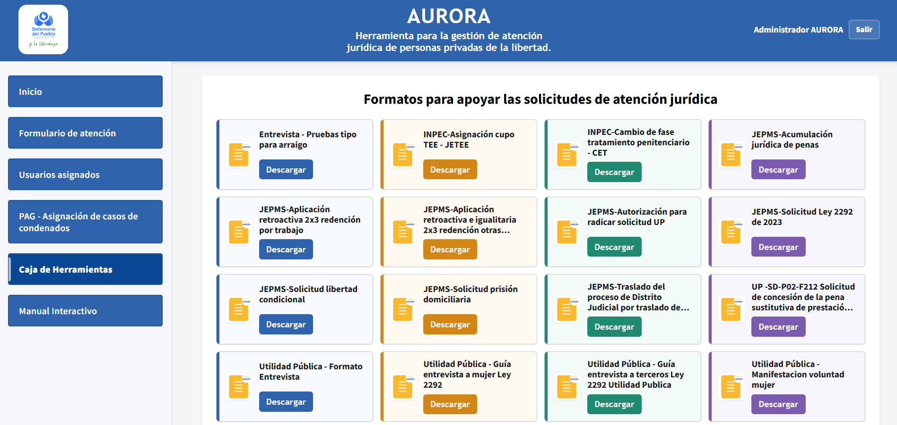

Figura 5. Captura de apoyo del módulo.

## Asignación y reasignación de defensores

1. Ingrese al módulo PAG - Asignación de casos de condenados.

2. Valide la cédula del PAG autorizado.

3. Aplique filtros si necesita ubicar registros específicos.

4. Seleccione uno o varios usuarios.

5. Seleccione el defensor correspondiente.

6. Guarde la asignación o reasignación.

7. Verifique que el cambio se vea reflejado en el listado.

La pantalla exige rol PAG. Una cuenta `admin` sin rol `pag` puede administrar accesos, pero no ejecutar la asignación. Antes de guardar, compruebe cantidad de filas seleccionadas y defensor nuevo; la reasignación cierra la relación activa anterior.

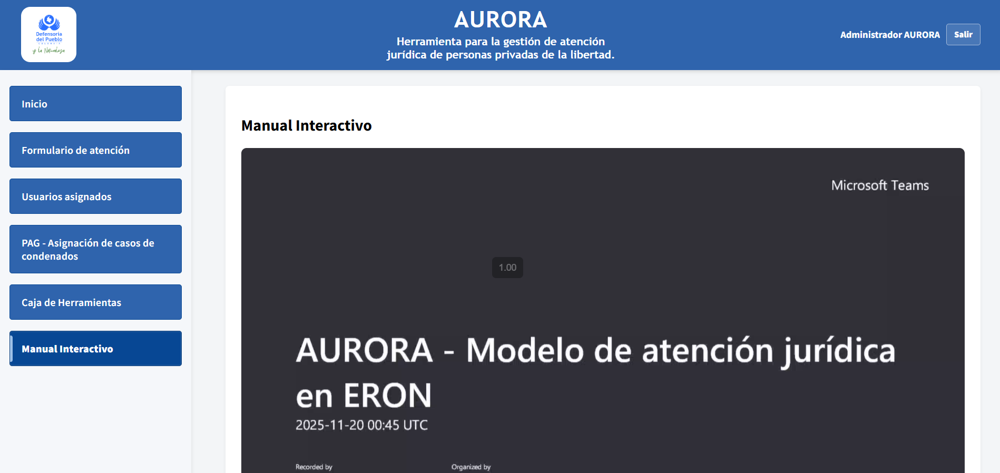

Figura 6. Captura de apoyo del módulo.

## Descarga de formatos

1. Ingrese a Caja de Herramientas.

2. Ubique el formato requerido.

3. Seleccione Descargar.

4. Verifique que el documento se abra o descargue correctamente.

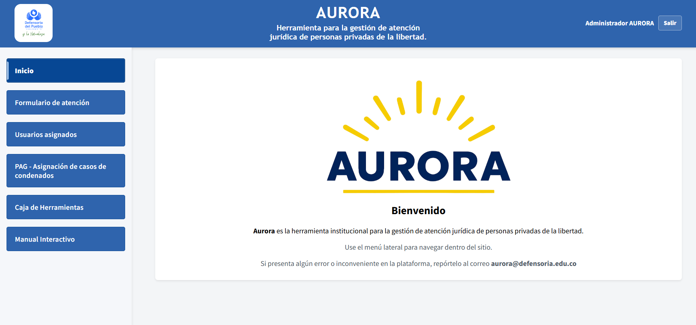

Figura 7. Captura de apoyo del módulo.

## Cargas mensuales

Este módulo solo aparece para usuarios con perfil administrador autorizado.

1. Ingrese a Cargas mensuales.

2. Seleccione la fuente del archivo: PONAL, SISIPEC o Aurora 1.0.

3. Adjunte el archivo .xlsx correspondiente.

4. Inicie la carga.

5. Revise el estado y el log de resultado.

6. Si una carga falla, revise el mensaje y solicite apoyo técnico antes de reintentar.

No renombre columnas ni cambie la estructura del Excel oficial. El estado puede pasar por pendiente, procesando, completado o error. Reintente únicamente después de corregir la causa. La acción de depuración de actuaciones ficticias está restringida, presenta conteo previo y solicita confirmación; no se usa para corregir casos reales.

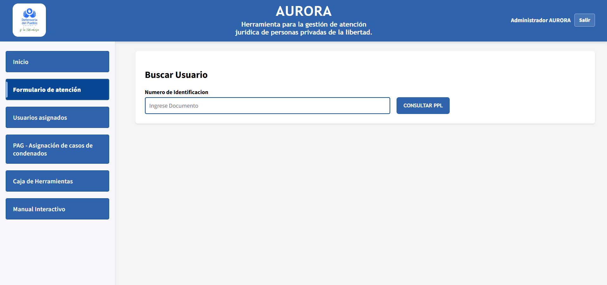

Figura 8. Captura de apoyo del módulo.

## Usuarios autorizados

El módulo aparece a cuentas con rol `admin`.

1. Consulte la lista antes de crear un registro.
2. Registre nombre, correo institucional y roles requeridos.
3. Use el estado habilitado para permitir acceso y deshabilitado para bloquearlo.
4. Para una carga masiva, seleccione un CSV y revise la vista previa.
5. Corrija correos inválidos, duplicados o registros existentes informados por la vista previa.
6. Confirme la importación y verifique los resultados.

Los cambios de rol y estado se aplican en las peticiones siguientes. La administración interna no crea ni restablece la contraseña institucional.

## Manual Interactivo

Manual Interactivo contiene tres tutoriales locales para defensor de condenados ERON, defensor Ley 906/CDT y PAG del programa de condenados. Seleccione el video correspondiente y utilice los controles del reproductor. Los tutoriales acompañan el manual escrito; las reglas vigentes de la aplicación prevalecen cuando una captura antigua difiere.

## Instalación y trabajo sin conexión

El navegador puede ofrecer Instalar aplicación. La instalación crea un acceso directo y conserva recursos básicos. Sin red, algunas escrituras admitidas quedan pendientes y se envían al recuperar conectividad.

Antes de cerrar el navegador confirme los mensajes de guardado. La cola pertenece a la cuenta autenticada: cerrar sesión o cambiar de usuario descarta operaciones pendientes de la identidad anterior. No use el modo sin conexión en un equipo compartido para registrar información sensible.

## Buenas prácticas de uso

- Use únicamente su cuenta autorizada.

- No comparta capturas con datos personales por canales no autorizados.

- Verifique los datos antes de guardar.

- Cierre sesión al terminar.

- Reporte incidentes indicando fecha, módulo y acción realizada.

- No cierre la pestaña durante una carga mensual ni repita Guardar mientras existe una operación en curso.

- En un incidente anote URL, hora, usuario, módulo, identificación consultada y mensaje visible, sin enviar contraseñas ni tokens.

## Mensajes y solución de problemas

| Situación | Acción del usuario |
| --- | --- |
| Sesión expirada | Ingrese nuevamente y compruebe si el último guardado fue confirmado. |
| Acceso denegado | Solicite validación de estado y roles; no intente usar la cuenta de otra persona. |
| Registro no encontrado | Revise identificación y filtros; retire filtros adicionales antes de escalar. |
| Defensor no aparece por nombre | Busque una parte del nombre, pruebe el nombre visible y valide un caso por identificación. |
| Error de red | Espere conectividad; verifique si la aplicación informó operación pendiente. |
| Error al guardar | Conserve el mensaje, no duplique la actuación y reporte al soporte. |
| Carga en error | Consulte el log visible y coordine corrección antes del reintento. |
| Formato no abre | Verifique permisos del enlace institucional y sesión vigente. |

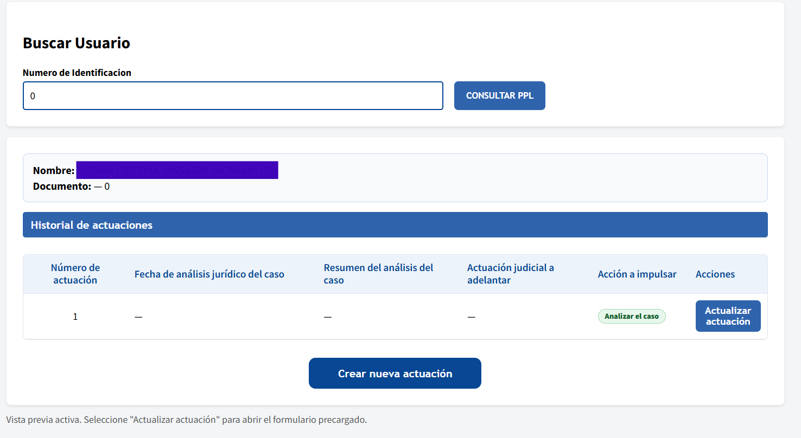

Figura 9. Captura de apoyo del módulo.

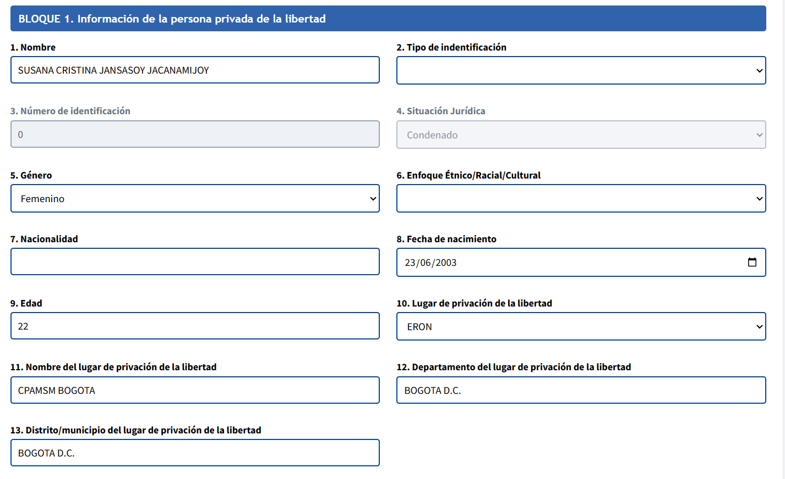

Figura 10. Captura de apoyo del módulo.

## Anexo de capturas de apoyo

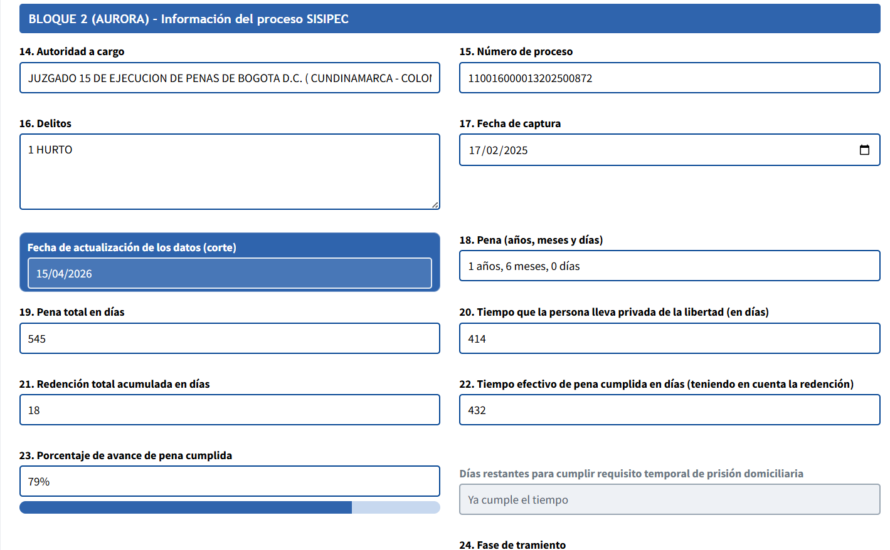

Captura de apoyo 1

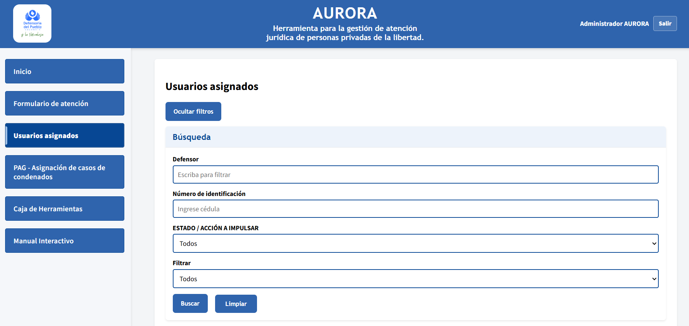

Captura de apoyo 2

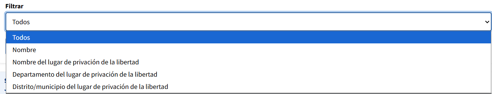

Captura de apoyo 3

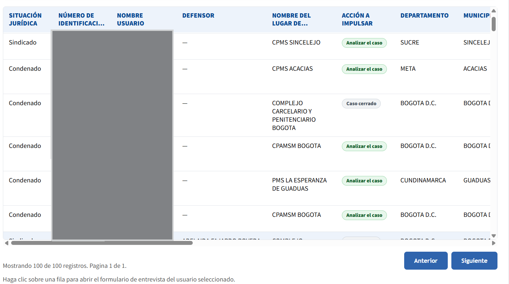

Captura de apoyo 4
