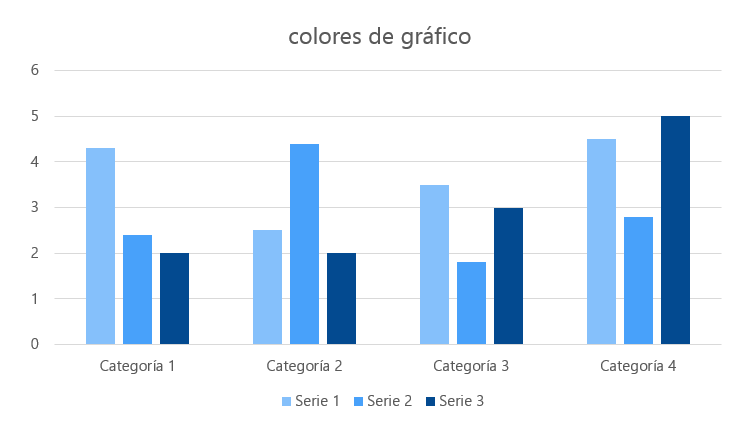
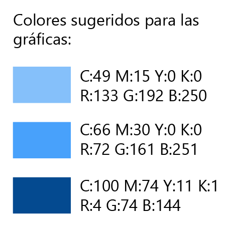

# Plantilla documental institucional 2025-2

> Estado documental: vigente al 2026-07-30.


Este archivo traslada a Markdown la finalidad de la plantilla Word de diseño. El formato Markdown prioriza estructura semántica, trazabilidad y lectura en repositorios; la diagramación de portada, fondos y cierre permanece representada en los recursos gráficos extraídos.

## Identificación

| Campo | Valor |
| --- | --- |
| Entidad | Defensoría del Pueblo |
| Dependencia | Dirección Nacional de Defensoría Pública |
| Documento | `<Título completo>` |
| Código documental | `<Código asignado>` |
| Versión | `<Mayor.menor>` |
| Fecha | `<AAAA-MM-DD>` |
| Responsable | `<Dependencia o cargo>` |
| Aprobación | `<Estado y autoridad>` |

## Control de cambios

| Versión | Fecha | Responsable | Descripción del cambio | Aprobación |
| --- | --- | --- | --- | --- |
| 0.1 | `<AAAA-MM-DD>` | `<Responsable>` | Borrador inicial. | En elaboración |

Cada versión registra cambios materiales. No se sustituyen fechas o responsables anteriores. Los estados recomendados son En elaboración, En validación, Aprobado y Obsoleto.

## Tabla de contenido

El visor Markdown genera navegación a partir de títulos. La jerarquía comienza en `#` para el título, `##` para secciones y `###` para subsecciones. No se omiten niveles únicamente por apariencia visual.

## Objeto

Describir el propósito, la decisión o la operación que soporta el documento. El objeto delimita qué queda cubierto y evita mezclar manual, procedimiento y evidencia sin identificación.

## Alcance

Indicar procesos, sistemas, ambientes, usuarios, periodos y exclusiones. Cuando un dato depende de otra autoridad, identificar quién lo confirma y en qué etapa.

## Definiciones y referencias

| Término o referencia | Definición o ubicación |
| --- | --- |
| `<Término>` | `<Definición precisa>` |
| `<Documento>` | `<Ruta institucional, versión y responsable>` |

Las referencias apuntan a versiones identificables. No se incluyen secretos, enlaces personales ni rutas locales de una estación de trabajo.

## Desarrollo

Presentar hechos verificables, responsables, entradas, procedimiento, salidas y excepciones. Los comandos se escriben en bloques con lenguaje:

```bash
comando --opcion valor
```

Las variables sensibles se representan con marcadores:

```dotenv
USUARIO=<valor-entregado-por-responsable>
SECRETO=<no-documentar>
```

## Roles y responsabilidades

| Rol | Responsabilidad | Evidencia |
| --- | --- | --- |
| `<Rol>` | `<Actividad y límite>` | `<Registro esperado>` |

## Validación

| ID | Caso | Precondición | Resultado esperado | Estado | Evidencia |
| --- | --- | --- | --- | --- | --- |
| DOC-001 | `<Caso>` | `<Condición>` | `<Resultado verificable>` | Pendiente | `<Ubicación>` |

Un resultado solo se marca Aprobado cuando existe evidencia. Los bloqueos y excepciones incluyen responsable y fecha de resolución.

## Riesgos, seguridad y protección de datos

Documentar riesgos, controles y datos tratados. Las credenciales, tokens, certificados privados, datos personales innecesarios y cadenas completas de conexión no se incorporan. Los ejemplos usan valores ficticios.

## Anexos

Los diagramas e imágenes se guardan en `assets/` y se referencian con texto alternativo explicativo:

```markdown

```





## Lista de publicación

- Ortografía, enlaces, tablas y jerarquía de títulos validados.
- Hechos contrastados con la versión vigente del sistema o proceso.
- Control de cambios actualizado.
- Secretos y datos personales ausentes.
- Comandos probados en el ambiente indicado.
- Imágenes disponibles mediante rutas relativas.
- Estado de aprobación y responsable explícitos.
